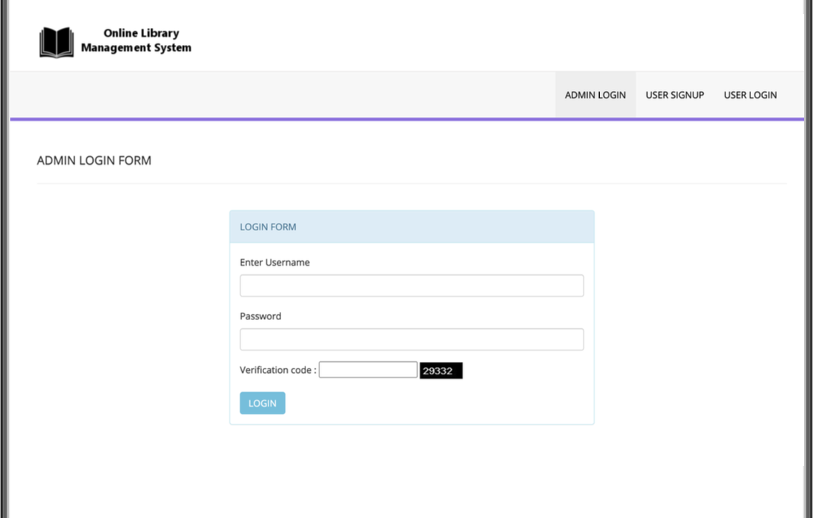
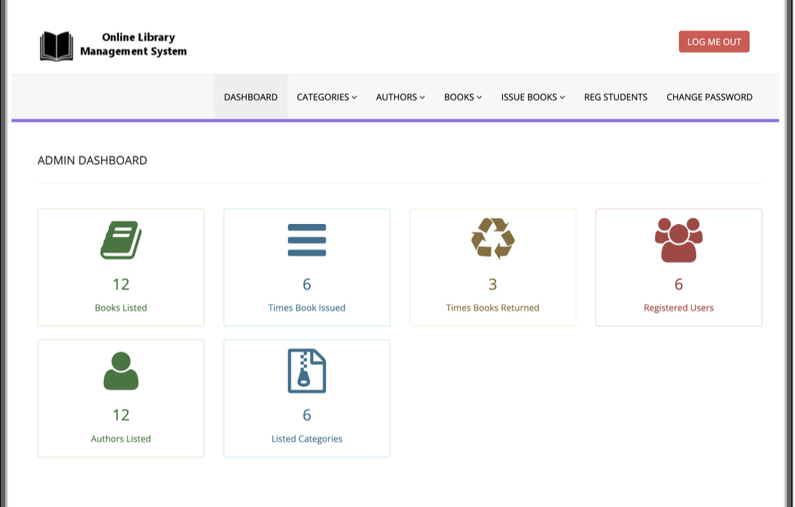
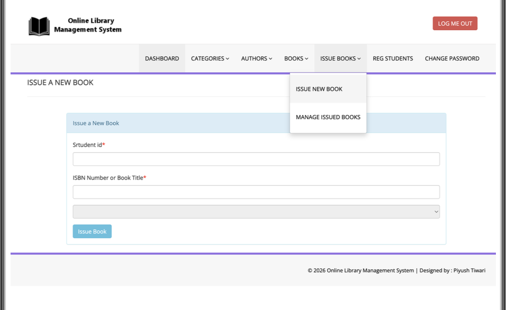
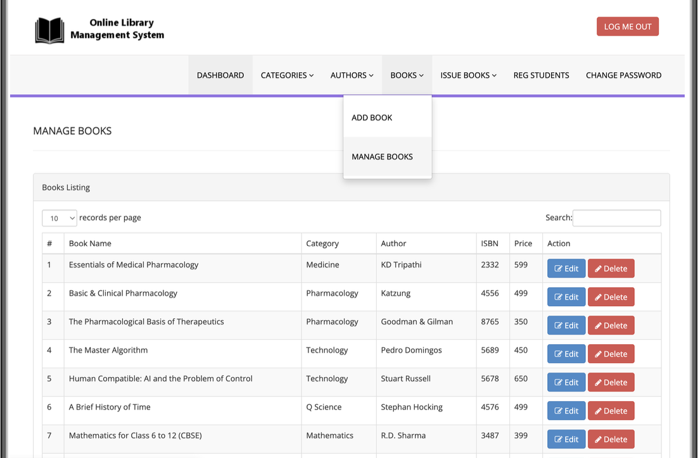
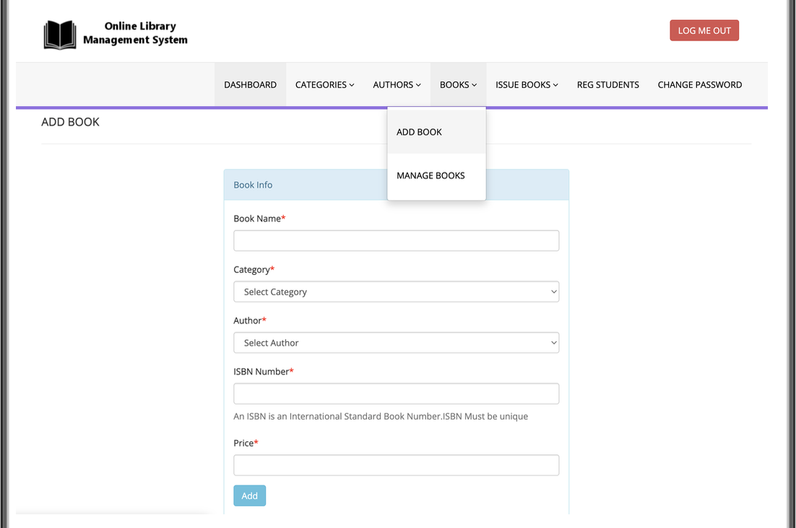

# Online-Library-Management-System
📚 Online Library Management System (PHP) is a web-based application designed to manage library operations digitally. It allows users to search, issue, and return books easily. The admin can manage books, users, and track issued records efficiently. This system helps automate library work and reduces manual effort. 💻🚀

## 👨‍💻 Author
- Name: Piyush Tiwari
- MCA Student

##  Features
👤 Student and Admin (Librarian) Login
📚 Book Search System
📖 Issue and Return Books
⏰ Fine Management (if any delay)
📊 Admin Dashboard
🧾 Student Record Management
🔔 Book Recommendation System

## 🛠️ Technologies Used
- HTML
- CSS
- JavaScript
- PHP
- MySQL

- ## ⚙️ How to Run
1. Install XAMPP
2. Copy project to htdocs folder
3. Start Apache & MySQL
4. Open localhost in browser

   ## 🗄️ Database Setup
- Import SQL file in phpMyAdmin

  ## 📜 License
This project is for educational purposes only.

  

## 📸 Screenshots

### Login Page

### Dashboard

### Issue Book

### Manage Book

### Add Book

## 🚀 Future Improvements
- Online payment system
- Email notifications
- Mobile app integration
